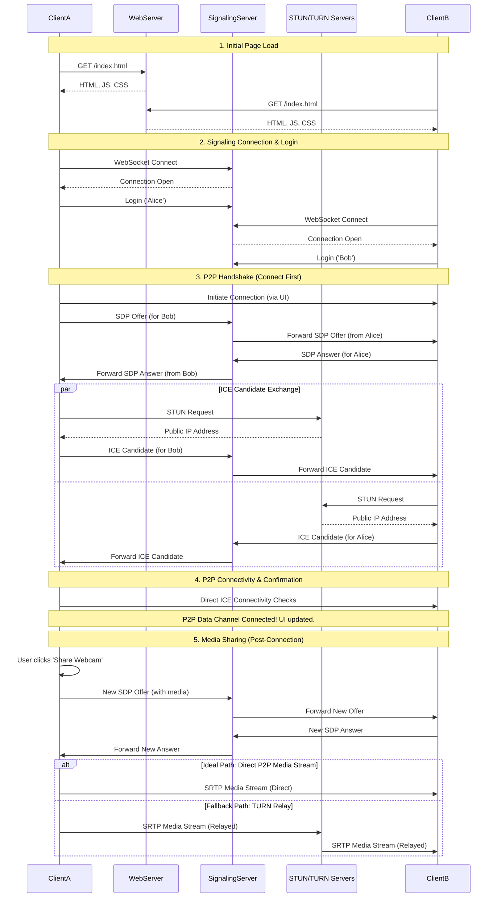

```mermaid
sequenceDiagram
participant ClientA
participant WebServer
participant SignalingServer
participant STUN_TURN as STUN/TURN Servers
participant ClientB

    Note over ClientA, ClientB: 1. Initial Page Load
    ClientA->>WebServer: GET /index.html
    WebServer-->>ClientA: HTML, JS, CSS
    ClientB->>WebServer: GET /index.html
    WebServer-->>ClientB: HTML, JS, CSS

    Note over ClientA, ClientB: 2. Signaling Connection & Login
    ClientA->>SignalingServer: WebSocket Connect
    SignalingServer-->>ClientA: Connection Open
    ClientA->>SignalingServer: Login ('Alice')
    ClientB->>SignalingServer: WebSocket Connect
    SignalingServer-->>ClientB: Connection Open
    ClientB->>SignalingServer: Login ('Bob')

    Note over ClientA, ClientB: 3. P2P Handshake (Connect First)
    ClientA->>ClientB: Initiate Connection (via UI)
    ClientA->>SignalingServer: SDP Offer (for Bob)
    SignalingServer->>ClientB: Forward SDP Offer (from Alice)
    ClientB->>SignalingServer: SDP Answer (for Alice)
    SignalingServer->>ClientA: Forward SDP Answer (from Bob)

    par ICE Candidate Exchange
        ClientA->>STUN_TURN: STUN Request
        STUN_TURN-->>ClientA: Public IP Address
        ClientA->>SignalingServer: ICE Candidate (for Bob)
        SignalingServer->>ClientB: Forward ICE Candidate
    and
        ClientB->>STUN_TURN: STUN Request
        STUN_TURN-->>ClientB: Public IP Address
        ClientB->>SignalingServer: ICE Candidate (for Alice)
        SignalingServer->>ClientA: Forward ICE Candidate
    end

    Note over ClientA, ClientB: 4. P2P Connectivity & Confirmation
    ClientA->>ClientB: Direct ICE Connectivity Checks
    Note over ClientA, ClientB: P2P Data Channel Connected! UI updated.

    Note over ClientA, ClientB: 5. Media Sharing (Post-Connection)
    ClientA->>ClientA: User clicks 'Share Webcam'
    ClientA->>SignalingServer: New SDP Offer (with media)
    SignalingServer->>ClientB: Forward New Offer
    ClientB->>SignalingServer: New SDP Answer
    SignalingServer->>ClientA: Forward New Answer

    alt Ideal Path: Direct P2P Media Stream
        ClientA->>ClientB: SRTP Media Stream (Direct)
    else Fallback Path: TURN Relay
        ClientA->>STUN_TURN: SRTP Media Stream (Relayed)
        STUN_TURN->>ClientB: SRTP Media Stream (Relayed)
    end

```
